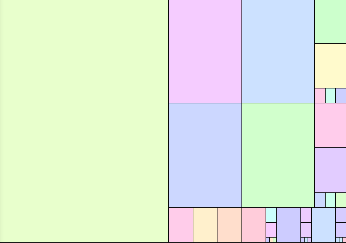

# Study-GenerativeArtWithMath

技術評論社の 数学から創るジェネラティブアート をやりながら参考例のprocessingのものをp5.jsに書き換えたもの

本のリンク  
[数学から創るジェネラティブアート](https://gihyo.jp/book/2019/978-4-297-10463-4)  

## result

DivRect

DivRectColor

DivSquare

RectDivRect

